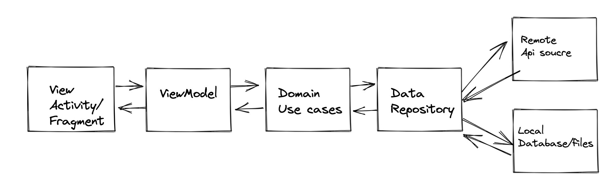

# Project Architecture
Used Clean Architecture + MVVM (data and domain can be created as independent kotlin modules,
but I have added them as part of app just to save some time)

# View
This layer mainly deals with the UI of the application and has its own presentation models.

Components
- **Activity/Fragment**: Presents data on the screen and pass user interaction to viewmodel
- **ViewModel**: Executes use cases based on user interaction and updates ui using LiveData
- **mappers**: Maps domain response as per presentation needs.

# Domain
Contains all the business logic for the application.Domain layers is independent of other layers, has its own models, so that changes in other layers will have no effect on domain layer.

Components
- **UseCase** : Handles business logic
- **Domain Models**: Represents structure of response data
- **Repository Interface**: To keep domain layer independent from data layer.

# Data
Manages application data, interacts with api and exposes data to domain layer

components
- **Repository** : Gets the requested data using api service ans exposes data to domain layer.
- **Mapper** : Used to map data models to domains models to keep domain independent of data layer.
- **DataModel** : Structure for data retrieved from remote data source.
- **Mappers** : To map data to domain layer models.

# Unit Test Cases
Included test cases for view model, repository and also mapper for testing for sorting and avoiding duplicate items.

